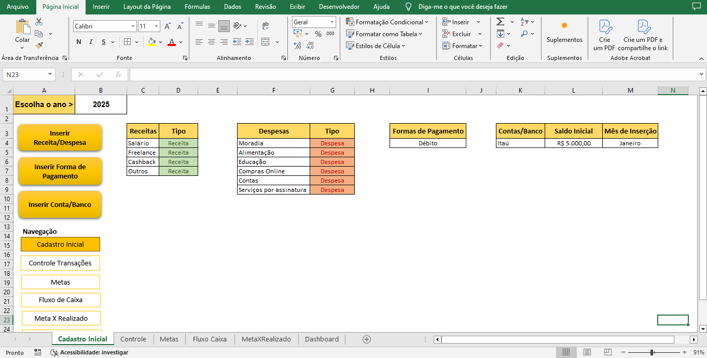
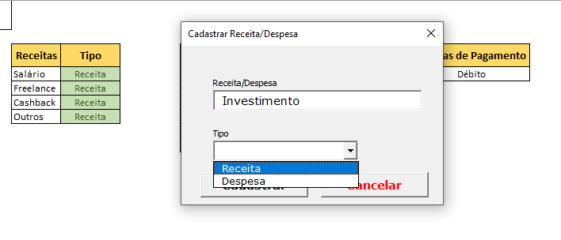
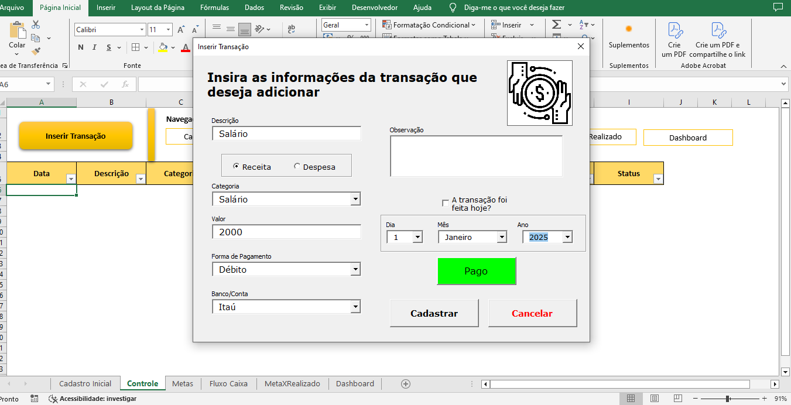
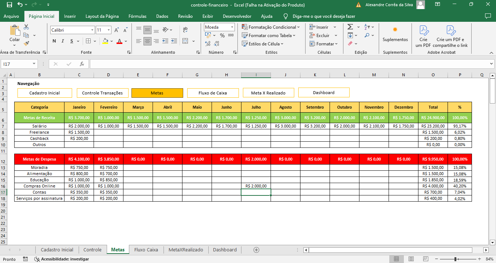
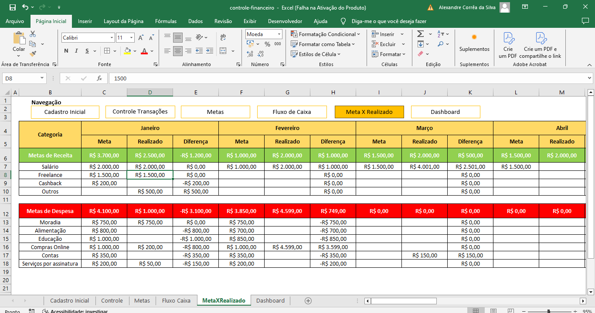
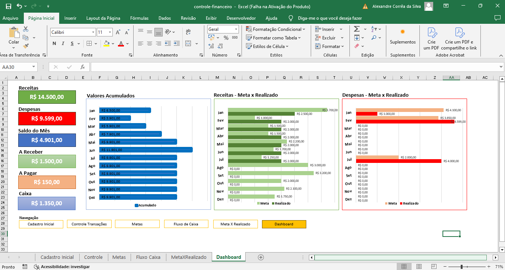

# Controle Financeiro - Planilha Automatizada em VBA

## 📌 Sobre o Projeto
Esta planilha foi desenvolvida para oferecer uma **gestão financeira automatizada**, permitindo o controle de receitas, despesas, metas e fluxo de caixa de forma **intuitiva e eficiente**.

### 🔹 Recursos Principais:
✔ Cadastro de categorias de receitas e despesas
✔ Registro de transações automatizado
✔ Acompanhamento de metas financeiras
✔ Controle do fluxo de caixa
✔ Comparação entre metas e valores realizados
✔ Dashboard com resumo e gráficos
✔ Backup e limpeza automática de dados

## 📂 Estrutura da Planilha
A planilha é composta por diferentes abas que trabalham em conjunto para proporcionar uma visão completa das finanças do usuário.

### **1️⃣ Planilha "Cadastro Inicial"**

- Permite cadastrar **categorias de receitas e despesas**, **formas de pagamento** e **bancos**.
- O usuário também pode definir o **saldo inicial** de cada banco.
- Tudo é feito por meio de **UserForms em VBA**, garantindo inserção automática dos dados.

### **2️⃣ Planilha "Controle"**

- Permite registrar todas as transações financeiras do usuário.
- Os campos disponíveis são:
  - 📅 **Data**
  - 📝 **Descrição**
  - 📂 **Categoria** (Baseada no "Cadastro Inicial")
  - 💰 **Tipo** (Receita ou Despesa)
  - 💲 **Valor**
  - 💳 **Forma de Pagamento**
  - 🏦 **Banco/Conta**
  - 🗒️ **Observação**
  - ✅ **Status** (Pago ou Não Pago)
- As transações são filtráveis por qualquer um desses critérios.
- Para transações **não pagas**, um **botão automático** é criado para marcar como "pago" quando quitado.

### **3️⃣ Planilha "Metas"**

- Ao cadastrar categorias de **despesas e receitas** no "Cadastro Inicial", elas são automaticamente inseridas nesta aba.
- Permite que o usuário defina **metas mensais** para cada categoria de receita e despesa.

### **4️⃣ Planilha "Fluxo de Caixa"**

- As informações das transações são **atualizadas automaticamente** aqui, organizadas por **mês**.
- O fluxo de caixa analisa:
  - 📊 **Valores de transação** (Receita ou Despesa)
  - 🏦 **Valores a receber/a pagar**
  - 📈 **Saldo acumulado mês a mês**

### **5️⃣ Planilha "Meta x Realizado"**

- Faz a **comparação automática** entre as **metas estipuladas** e os valores **realmente realizados**.
- Assim que uma meta é adicionada na aba "Metas", ela é automaticamente registrada aqui.
- Os valores realizados são trazidos diretamente da aba "Controle".
- Permite visualizar a **diferença entre os valores planejados e os reais** para cada categoria de despesa e receita.

### **6️⃣ Planilha "Dashboard"**

- Exibe um **resumo completo** das finanças:
  - 📊 **Total de receitas e despesas do ano**
  - 📆 **Saldo mensal**
  - 💰 **Valores totais a receber e a pagar**
  - 📉 **Necessidade de caixa**
- Apresenta **3 gráficos principais**:
  - **Valores acumulados mês a mês** (Gráfico de barras verticais)
  - **Comparação entre metas e realizações de receitas**
  - **Comparação entre metas e realizações de despesas**

## ⚙️ Automação em VBA
- A planilha é **totalmente automatizada** utilizando **VBA e Macros**.
- Todas as inserções e cálculos são realizados de forma **automática**.
- Recursos adicionais incluem:
  - 🔄 **Backup manual e automático**
  - 🧹 **Limpeza automática de dados ao iniciar um novo ano**
  - 🧭 **Navegação automatizada por meio de botões**